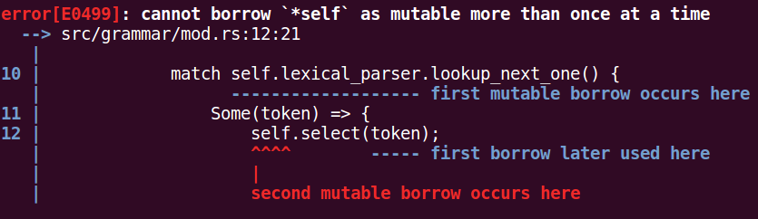

## 结构定义
```rust
 3 pub struct GrammarParser<FT: FnMut() -> CallbackReturnStatus> {
 4     lexical_parser: LexicalParser<FT>
 5 }
 6 
 7 impl<FT: FnMut() -> CallbackReturnStatus> GrammarParser<FT> {
 8     pub fn parser(&mut self) {
 9         loop {
10             match self.lexical_parser.lookup_next_one() {
11                 Some(token) => {
12                     self.select(token);
13                 },
14                 None => {
15                     break;
16                 }
17             };
18         }
19     }
20 
21     fn select(&mut self, token: &TokenVecItem) {
22     }
23 
24     pub fn new(lexical_parser: LexicalParser<FT>) -> Self {
25         Self {
26             lexical_parser: lexical_parser
27         }
28     }
29 }
```

- 为什么错了 ?
	- 这是借用检查器的典型错误
		* token 是 lexical_parser 中成员的引用, 而 lexical_parser 是 GrammarParser 的成员, 那么 token 也属于GrammarParser 的引用(rust 是通过生命周期推断出来的这一层关系); 再看一下 select 的定义 **fn select(&mut self, token: &TokenVecItem)**, 第一个参数是 **&mut self**, 第二个参数是 **token: &TokenVecItem**, 在 select 作用域下, 就存在 同一个地址的可变引用和不可变引用, 那么导致借用检查器报错

- 解决问题
```rust
 3 pub struct GrammarParser<FT: FnMut() -> CallbackReturnStatus> {
 4     lexical_parser: LexicalParser<FT>
 5 }
 6 
 7 impl<FT: FnMut() -> CallbackReturnStatus> GrammarParser<FT> {
 8     pub fn parser(&mut self) {
 9         loop {
10             let index = match self.lexical_parser.lookup_next_one_index() {
11                 Some(index) => {
12                     index
13                 },
14                 None => {
15                     break;
16                 }
17             };
18             self.select(index);
19         }
20     }
21 
22     fn select(&mut self, index: usize) {
23         let token = self.lexical_parser.token_by_index(index);
24     }
25 
26     pub fn new(lexical_parser: LexicalParser<FT>) -> Self {
27         Self {
28             lexical_parser: lexical_parser
29         }
30     }
31 }
```
- **lookup_next_one_index**: 返回token的索引
- **token_by_index**: 通过索引从 缓存中找到token实例
- 这样就避免了 借用检查

- 问题解决了, 但是不是很满意
	- 想一下, 之后如果要多次使用同一个token, 那么每次都要传递索引, 然后再通过索引取值, 这不光影响效率(重复通过同样的索引取值), 而且代码看上去也不是很整洁
	- 但是问题就是, 如何更改呢, 我们一定是要让可变和不可变共存的(这样就能保证只读一次索引), 但是这又违背了借用检查器规则
		* 在代码中, 在语法分析代码中, 一定不会更改lookup的可变引用的, 这是人知道的, 但是编译器没有那么智能, 它不知道, 那我们就要想办法越过它
	- 这里使用一个技巧 **原始指针**
	- 用过 c/c++ 的读者对于指针一定不陌生, 指针非常强大, 但是也非常的危险; 直接操作指针就是操作内存(这简直就是无所不能了), 我们知道每个token item的声明周期在我们 lookup 之后是不会消失的, 那么我们就可以放心的将这个引用转换为指针, 然后用一个整数类型保存指针的地址, 用的时候再将指针取出来, 这样的话就是整数的传递, 这就完全避开了借用检查器
	
- 为了便于操作, 笔者将指针转换后的整数封装一下
```rust
 96 pub struct TokenPointer(usize);
 97 
 98 impl TokenPointer {
 99     pub fn from_ref(item: &TokenVecItem) -> Self {
100         Self(item as *const TokenVecItem as usize)
101     }
102 
103     pub fn as_ref<'a>(&self) -> &'a TokenVecItem {
104         unsafe {
105             (self.0 as *const TokenVecItem).as_ref().expect("should not happend")
106         }
107     }
108 }
```
- TokenPointer 结构存储了一个 usize 的值, 就是转换后的指针
- **from_ref**: 就是从 &TokenVecItem 转换为 TokenPointer 对象
- **as_ref**: 就是将存储的指针值转换为 TokenVecItem 引用

- 再看一下新增的 lookup 方法
```rust
189     pub fn lookup_next_n_ptr(&mut self, n: usize) -> Option<TokenPointer> {
190         match self.lookup_next_n_index(n) {
191             Some(index) => {
192                 match self.tokens_buffer.get(index) {
193                     Some(token) => {
194                         Some(TokenPointer::from_ref(token))
195                     },
196                     None => {
197                         None
198                     }
199                 }
200             },
201             None => {
202                 None
203             }
204         }
205     }
```
- 方法返回 TokenPointer 对象, 之后就可以通过 TokenPointer 的 as_ref 方法获取 TokenVecItem 的引用, 操作就行了(以后方法中如果需要, 直接传递TokenPointer对象即可)

