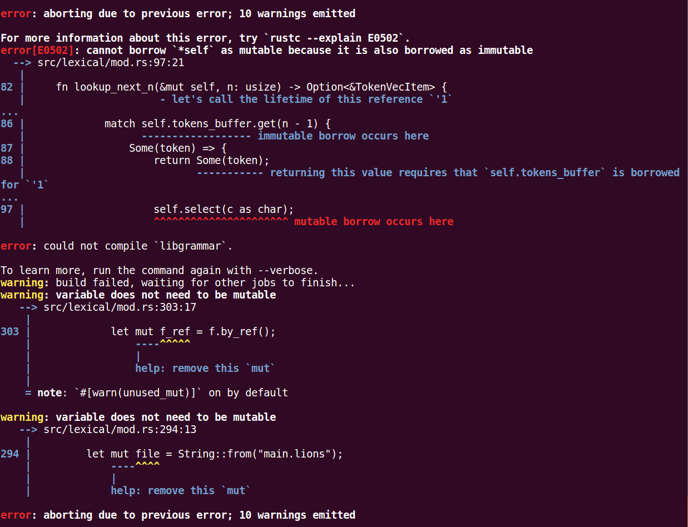

## token中字符的遍历分析
### 分析
- token字符遍历一般有两种方式
	- way1: 先解析完所有的token, 并将token存储在容器中, 在语法分析阶段依次读取token流中的每一个元素, 接着进行语法分析
	- way2: 语法分析时再去分析token(这一般称之为"一遍", 也就是遍历一遍)
- 很显然, way1的不管在内存还是在效率上都是低于way2的, 另外, 如果文件非常的大(以至于超过了内存), 那么way1的方式更是不可用(虽然可以使用先写入一部分, 然后清空内存, 再继续, 但是这样一来, 又增加了磁盘的读写消耗)
- lions-language的虽然也是先编译, 再运行(类似java虚拟机), 所以在编译期如果慢一点是不会影响运行时的效率的; 但是lions-language的起初设想就是为了实现语言级别的进程间通信, 所以在一定情况下, 需要动态执行, 所以需要考虑编译期的效率

### 实现思路
- 词法分析器结构字段
	- 缓存一定大小的字节数组: content
		- 这个是每次循环的源头(每一次都是从content中取字符分析)
	- 设置一个更新源代码字节数组的回调: cb
		- 该回调中一般是读取文件接下来的内容/cmd/网络...(这里就是lions-language将来实现分布式通信的基础)
	- 存储token的缓存数组: tokens_buffer
		- 用于存储解析完毕的token(每次外部调用lookup_next时, 会先从tokens_buffer中查找, 如果存在, 那么就直接读取tokens_buffer中的值返回, 如果不存在, 就继续从content中解析)
- 步骤
	- 查询tokens_buffer中是否存在指定个数的token
		- 存在: 返回tokens_buffer中的token元素
		- 不存在: 从content中分析下一个token
			- content中不存在, 则调用 cb 更新 content, 然后继续分析content

### 结构定义
```rust
 96 pub struct LexicalParser<T: FnMut() -> CallbackReturnStatus> {
 97     file: String,
 98     line: u64,
 99     col: u64,
100     content: VecU8,
101     cb: T,
102     tokens_buffer: Vec<TokenVecItem>
103 }
```
- file: 文件路径
- line: 行数
- col: 列数
- content: 缓存的字符序列
- cb: 外部提供的闭包 **这个 cb 要记住, 以后都用 cb 说明**
	- cb 要求返回一个 content, 在 LexicalParser 内部, 如果 content 不足, 将调用 cb 更新 content
	- 为什么选择了闭包, 而不是回调呢
		* 因为一般外部调用者是从 IO 中读取数据, 然后在 cb 中更新新的数据; 那么必然需要读取周边的环境, 所以回调是做不到的
	- 使用 **FnMut** 类型的闭包, 因为需要修改环境中的量, 所以需要可变的闭包
- tokens_buffer: 缓存解析完的 token 的临时缓存
	- 如果外部需要下一个token, 但是该缓存中不足, 需要从 content 中解析, 解析后存储该缓存

### 看一下content字段 VecU8中实现的方法
```rust
 5 #[derive(Debug)]
 6 pub struct VecU8{
 7     v: Vec<u8>,
 8     index: usize
 9 }
10 
11 impl VecU8 {
12     fn skip_next_n(&mut self, n: usize) {
13         /*
14          * 跳过n个字符
15          * */
16         if n > self.v.len() {
17             panic!(
18             format!(
19             "skip next must be called after lookup, n: {}, self.v.len(): {}",
20             n, self.v.len()));
21         }
22         for _ in 0..n {
23             self.v.remove(0);
24         }
25         self.index = 0;
26     }
27 
28     fn skip_next_one(&mut self) {
29         self.skip_next_n(1);
30     }
31 
32     fn virtual_skip_next_n(&mut self, n: usize) {
33         /*
34          * 没有实际的skip, 只是追加索引, 这个方法是为了回溯使用
35          * */
36         self.index += n;
37     }
38 
39     fn virtual_skip_next_one(&mut self) {
40         self.virtual_skip_next_n(1);
41     }
42 
43     fn backtrack_n(&mut self, n: usize) {
44         /*
45          * 回溯
46          * */
47         if n > self.index {
48             panic!(
49             format!(
50             "backtrack n > self.index(backtrack_n be called times > 1), n: {}, self.index: {}",
51             n, self.index));
52         }
53         self.index -= n;
54     }
55 
56     fn lookup_next_n(&self, n: usize) -> Option<char> {
57         if n == 0 {
58             panic!("n > 0");
59         }
60         let index = self.index + n - 1;
61         if (self.v.len() > 0) && (index > self.v.len() - 1) {
62             /*
63              * 没有可以获取的值了
64              * */
65             return None;
66         } else {
67             if self.v.len() == 0 {
68                 return None;
69             }
70             return Some(self.v[index] as char)
71         }
72     }
73 
74     fn lookup_next_one(&self) -> Option<char> {
75         return self.lookup_next_n(1);
76     }
77 
78     fn append(&mut self, mut content: VecU8) {
79         self.v.append(&mut content.v);
80     }
81 
82     pub fn from_vec_u8(v: Vec<u8>) -> Self {
83         Self{
84             v: v,
85             index: 0
86         }
87     }
88 
89     fn new() -> Self {
90         Self{
91             v: Vec::new(),
92             index: 0
93         }
94     }
95 }
```
- 代码说明
	- TODO ...

### 实现lookup_next_n
- 功能
	- 查看第n个token
- 方法原型
```rust
fn lookup_next_n(&mut self, n: usize) -> Option<&TokenVecItem>;
```
- 方法实现
	```rust
	82	    fn lookup_next_n(&mut self, n: usize) -> Option<&TokenVecItem> {
	83         let tokens_len = self.tokens_buffer.len();
	84         if tokens_len == 0 {
	85         } else {
	86             match self.tokens_buffer.get(n - 1) {
	87                 Some(token) => {
	88                     return Some(token);
	89                 },
	90                 None => {
	91                 }
	92             }
	93         }
	94         loop {
	95             match self.content.lookup_next_one() {
	96                 Some(c) => {
	97                     self.select(c as char);
	98                     return None;
	99                 },
	100                 None => {
	101                     match (self.cb)() {
	102                         CallbackReturnStatus::Continue(content) => {
	103                             *(&mut self.content) = content;
	104                             continue;
	105                         },
	106                         CallbackReturnStatus::End => {
	107                              return None;
	108                         }
	109                     }
	110                 }
	111             }
	112         }
	113     }
	```
	- 编译一下(看一下结果)
	
	- 编译器告诉我们错误了, 这是为什么呢?
		- 编译器告诉我们 第86行的 ***match self.tokens_buffer.get(n - 1)*** 这一句是不可变的借用了self中的content, 也就是对self进行了不可变借用; 但是第97行 ***self.select(c as char);*** 又可变的借用了self, 看一下 select 的方法原型
		```rust
		fn select(&mut self, c: char);
		```
		select需要可变的借用self; 编译器提示的意思是说: 在不可变借用的作用域下, 使用了可变借用, 这是rust借用检查器所不允许的; 但是读者可能发现了, 86行和97行的作用域没有交叠, 那为什么会报错呢? 仔细观察看一下提示的错误, 可以发现编译器提示了生命周期的问题, 观察一下方法的返回值, 方法的返回值是一个引用, 而这个引用正是88行返回的, 也就是tokens_buffer中的一个引用, 这样的话, 作用域就存在交叠了, 这样的话就满足了 不可变借用下使用了可变借用的情况, 那么编译器将报错; 其实笔者觉得, 这种情况下, 编译器不应该给出错误, 因为 88 行明确给出了 return, 也就是说如果执行到了88行, 那么88行之后的代码根本不会执行, 所以不可能改变tokens_buffer中引用的值(也就是不会出悬垂), 可能辛勤工作在rust编译器一线的功能是正在完善这个问题, 期待rust会越来越好
		- ***这里多说一下借用检查器为什么限制不可变借用下使用可变借用***
			```rust
			1 fn main() { 
			2     let mut v = vec!["hello".to_string(), "world".to_string()];
			3     for item in v.iter() {
			4         v.remove(0);
			5         println!("{}", item);
			6         return;
			7     }
			8 }
			```
			这一段代码中, 第3行的 item 是 v数组中的一个元素的引用, 而第4行调用了remove方法, 但是第5行访问了item的值, 此时如果是C/C++, 那么item将会变成悬垂指针, 第5行将会导致崩溃, rust就从编译阶段限制了这种情况的发生
	- 对于编译错误, 该如何解决呢? 这需要从根本出发, 既然返回了引用导致了错误, 那么解决方案就是不返回引用, 而是返回索引
		```rust
		  133	  fn lookup_next_n(&mut self, n: usize) -> Option<&TokenVecItem> {
		  134         match self.lookup_next_n_index(n) {
		  135             Some(index) => {
		  136                 return self.tokens_buffer.get(index);
		  137             },
		  138             None => {
		  139                 return None;
		  140             }
		  141         }
		  142     }
		  143 
		  144     fn lookup_next_n_index(&mut self, n: usize) -> Option<usize> {
		  145         loop {
		  146             let tokens_len = self.tokens_buffer.len();
		  147             if tokens_len == 0 {
		  148                 /*
		  149                 ** 缓存中没有数据 => 从 content 中读取
		  150                 */
		  151             } else {
		  152                 /*
		  153                 * 缓存中存在数据
		  154                 */
		  155                 if tokens_len >= n {
		  156                     /*
		  157                     * 缓存中的token满足n个
		  158                     */
		  159                     return Some(n - 1);
		  160                 } else {
		  161                     /*
		  162                     * 缓存中的token不足n个 => 从 content 中读取
		  163                     */
		  164                 }
		  165             }
		  166 
		  167             match self.content.lookup_next_one() {
		  168                 Some(c) => {
		  169                     self.select(c as char);
		  170                 },
		  171                 None => {
		  172                     match (self.cb)() {
		  173                         CallbackReturnStatus::Continue(content) => {
		  174                             /*
		  175                              * 回调的结果是继续 => 当前解析的文件还存在待解析的字符串
		  176                              * 1. 使用 回调的content, 修改 self.content
		  177                              * 2. 下一次的时候就是用最新的 content 循环
		  178                              */
		  179                             *(&mut self.content) = content;
		  180                             continue;
		  181                         },
		  182                         CallbackReturnStatus::End => {
		  183                             /*
		  184                              * 不存在待解析的字符串 (读到了文件的最尾部)
		  185                              */
		  186                              return None;
		  187                         }
		  188                     }
		  189                 }
		  190             }
		  191         }
		  192     }
		```
		拆分成两个方法, lookup_next_n_index返回找到的索引, lookup_next_n通过索引返回token的引用

