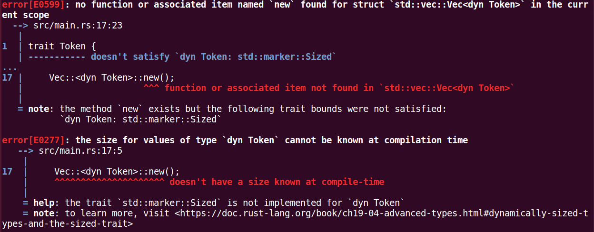

## 概述
- 主要说明 token 结构体的内容, 字段说明
- token中必要方法的解决方案

## TokenContext结构内容
- file: 文件完整路径
	- 方便检测到错误时, 可以定位所在文件
- line: 行号
	- 记录行号为了在检测到错误时, 可以提示用户错误所在的行
- token_type: token类型

## token中涉及到的方法(nup 和 led)
- 读者这里先不要管 nup 和 led 是什么, 现在只要认为是每一个token都需要实现的两个方法; 比如说, 提取出了 + token(TokenType_Plus), 那么 TokenType_Plus 的token实例是需要实现 nup 和 led 的
- 还需要了解一点, 词法解析阶段得到的token是需要存储在一个容器中, 那么就要思考如何将不同类型的token放在同一个容器内呢
- 这里有多种做法, 下面讨论一下每一种方式的实现原理和最终的选择

### 一个Token结构, 存储了回调指针 (以下使用 way1 替代说明)
- 类似这样(只是说明, 和实际代码不一致)

```rust
type NupCallback = fn();
type LedCallback = fn();

struct Token {
	nup: NupCallback,
	led: LedCallback
}
```

- 有的读者可能会在token对象创建的时候, 将临时的匿名函数赋值给 nulCallback / ledCallback, 如:
```rust
let t = Token{
	nup: || {
	},
	led: || {
	}
};
tokens.push(t);
```
	- 这种方式也是可以的, 但是会有性能问题, 每创建一个闭包, 编译器会创建一个对象, 这就导致每一个token对象的nup/led回调都创建一个函数对象; 那可能又有读者会问, 这和上面的全局创建的fn有什么区别呢? 词法分析是针对单词(这里的单词不是指英文单词, 这里指的是可以作为语法分析的最小单元)而言的, 而用户编码中, 必然是一种token出现过多次(非常简单的代码就不说了); 举个例子: + 号, 在用户编码过程中, 会出现过很多次
		- 全局的fn
			- 每一个 + 号token都共享同一块函数定义的地址
		- 闭包fn
			- 每一个 + 号token都会被创建函数对象
	- 计算一下如果有100个 + 号token, 全局的fn, 之消耗了一份内存, 而闭包fn将消耗 100份内存
	
### 多个Token结构, 每一个结构都实现了同样的必要函数 (以下使用 way2 替代说明)
- 像这样(只是说明, 和实际代码不一致)

```rust
trait Token {
	fn nup(&self);
	fn led(&self);
}

// + 号 token
struct PlusToken {
}

// id token
struct IdToken {
}

impl Token for PlusToken {
	fn nup(&self) {
	}
	fn led(&self) {
	}
}

impl Token for IdToken {
	fn nup(&self) {
	}
	fn led(&self) {
	}
}
```

- 这种方式就是类似设计模式中模板方法模式(具体做什么由子类决定)
- **注意**: 这里需要重点注意一下rust中, 如何将trait放入到Vec中(因为这个用法和编译器原理有一定的关系, 需要花一点篇幅来介绍)
	- 相信有面向对象的读者第一想法就是如下实现方式
	```rust
	1 trait Token {
    2     fn nup(&self);
    3     fn led(&self);
    4 }
    5 
    6 struct PlusToken {
    7 }
    8 
    9 impl Token for PlusToken {
   10     fn nup(&self) {
   11     }
   12     fn led(&self) {
   13     }
   14 }
   15 
   16 fn main() {
   17     Vec::<dyn Token>::new();
   18 }
	```
	- 但是, 事实并没有想象中的那么顺利, 编译一下:
		
		重点是这一句 *doesn't satisfy \`dyn Token: std::marker::Sized\`*, 意思是说, Vec的模板参数需要满足 std::marker::Sized 这个 trait, *std::marker::Sized* 标记的类型, 需要在编译期就要知道大小, 然而 trait 不是实体对象, 只要实现该trait的类型, 在这里都可以被指定, 那么trait很显然是无法在编译期知道大小的, 所以编译器会报错, 这个是Vec实现者强制要求的条件. 实现者强制要求这个条件, 是因为Vec是动态数组, 可以动态扩容, 如果不知道每一个元素的大小, 无法分配连续的内存
	- 那如何解决呢? 仔细想想, 既然需要固定大小, 那么就让它固定大小就好了, 什么类型一定是固定大小的呢, 那就是指针, 所以只需要在外层套一个Box智能指针就好了
	```rust
	1 trait Token { 
	2     fn nup(&self);
	3     fn led(&self);
	4 }
	5 
	6 struct PlusToken { 
	7 }
	8 
	9 impl Token for PlusToken { 
	10     fn nup(&self) { 
	11     } 
	12     fn led(&self) { 
	13     } 
	14 }
	15 
	16 fn main() { 
	17     Vec::<Box<dyn Token>>::new();
	18 }
	```

### token中涉及到的方法的最终实现方式
- way1和way2的区别
	- 这里需要说明一下way2的函数存储方式
		way2是将nup/led方法存储在具体的Token结构中, 关于这一点可能有些读者不是很了解编译器是如何存储结构中的方法的; 其实结构体中的方法, 只会定义一次, 也就是说不管有多少个结构体实例, 其实只有一份内存, 而每一个对象中只是存储了方法定义位置的指针, 需要调用的时候, 通过指针去调用方法
		说到这里, 读者应该已经发现了, 其实way1的函数存储方式和way2的方法存储方式对编译器来说是一样的, 每一个对象中存储的都是函数指针, 而不是具体的函数定义, 所以从这一点看来, way1和way2没有区别
	- 接下来就是way1和way2存储在容器中的比较
		way1是将整个结构对象存储在容器中, 如果容器是连续内存(动态数组), 那么访问效率会很高, 但是存在问题, 在动态数组扩容的时候, 将导致内存的重新分配, 结构内容多的情况下, 将有较大的内存拷贝消耗; 如果容器是离散内存(链表结构), 没有了动态分配问题, 但是随机访问的效率没有顺序方法的效率高
		way2如果放在容器中, 其实每一个元素的大小都是固定的(前面讨论过, 这种方式下, 容器中存储的是指针, 所以大小是固定的, 而且数据量较小), 如果容器是连续内存, 尽管在扩容时, 会有拷贝动作, 但是毕竟每一个元素的空间很小, 所以可以忽略这种影响, 在这种情况下, way2要优于way1; 当容器是离散内存时, 会产生两次随机内存访问(第一次是容器内部获取元素值时的随机访问; 第二次是通过容器中存储的指针, 找对象值的随机访问), 而在这种情况下, way1要优于way2; way2是存在运行时消耗, 而way1在编译期就可以确定大小, 没有运行时消耗, 这方面考虑的话, way1要优于way2

- 选择
	* 因为 lions-language 是 "一遍" 形式的, 在获取token的时候, 进行词法解析, 所以不需要很大的存储空间来存储大量的 token, 而且基本都是 lookup 一个token, 使用完之后, 就从数组中弹出了, 所以可以把 token buffer 的容量设为一个较小的数值(比如说5), 那么就不会进行动态扩容; 那么在顺序内存中取值效率便是最高的
	* 介于 way1 不存在运行时开销, 而且是顺序存储方式, 另外, 最令人担忧的动态扩容消耗也不会存在, 所以 way1 是这种场景下的最佳选择

## Token struct定义
```rust
158 pub struct Token<T: FnMut() -> CallbackReturnStatus, CB: Grammar> {
159     pub context: TokenContext,
160     pub attrubute: &'static TokenAttrubute,
161     pub nup: NupFunc<T, CB>,
162     pub led: LedFunc<T, CB>
163 }
164 
165 impl<T: FnMut() -> CallbackReturnStatus, CB: Grammar> Token<T, CB> {
166     pub fn context_ref(&self) -> &TokenContext {
167         &self.context
168     }
169 
170     pub fn token_attrubute(&self) -> &'static TokenAttrubute {
171         self.attrubute
172     }
173 
174     pub fn nup(&self, grammar: &mut GrammarParser<T, CB>, express_context: &ExpressContext<T, CB>) -> TokenM    ethodResult {
175         (self.nup)(self, grammar, express_context)
176     }
177 
178     pub fn led(&self, grammar: &mut GrammarParser<T, CB>, express_context: &ExpressContext<T, CB>) -> TokenM    ethodResult {
179         (self.led)(self, grammar, express_context)
180     }
181 }
```
- context字段: 存储 token 的一些上下文数据, 比如 行号 / token类型
```rust
145 #[derive(Default)]
146 pub struct TokenContext {
147     // 所在行号
148     pub line: u64,
149     // 列号
150     pub col: u64,
151     // token类型
152     pub token_type: TokenType,
153 }
```
- attrubute字段: 存储 token 的静态属性, 该结构中的成员全部都为 **'static** 的, 因为存储的是都是不会变更的数据, 定义为静态的可以降低内存消耗, 不用每一次调用 token_attrubute 或者 创建一个Token对象 时都需要创建一个新的对象
	- rust的第三方中有一个 lazy_static 的 crate, 该 crate 可以创建静态量
```rust
84 pub enum TokenOperType {
85     NoOperate,
86     Operand,
87     Operator
88 }
94 pub struct TokenAttrubute {
95     pub bp: &'static u8,
96     pub oper_type: &'static TokenOperType
97 }
```
- nup和led在语法分析阶段再做解释
- context_ref方法返回 TokenContext 的引用, 便于操作

### 作为例子, 看一下 number 的定义
```rust
 5 pub struct NumberToken {
 6 }
 7 
 8 lazy_static!{
 9     static ref number_token_attrubute: TokenAttrubute = TokenAttrubute{
10         bp: &0,
11         oper_type: &TokenOperType::Operand
12     };
13 }
14 
15 impl NumberToken {
16     fn nup<T: FnMut() -> CallbackReturnStatus, CB: Grammar>(token: &Token<T, CB>, grammar: &mut GrammarParse    r<T, CB>, express_context: &ExpressContext<T, CB>) -> TokenMethodResult {
17         TokenMethodResult::None
18     }
19 }
20 
21 impl NumberToken {
22     pub fn new<T: FnMut() -> CallbackReturnStatus, CB: Grammar>(context: TokenContext) -> Token<T, CB> {
23         Token{
24             context: context,
25             attrubute: &*number_token_attrubute,
26             nup: token::default_nup,
27             led: token::default_led
28         }
29     }
30 }
```
- number_token_attrubute 就是静态量, 被赋予 Token 中 attrubute 字段

