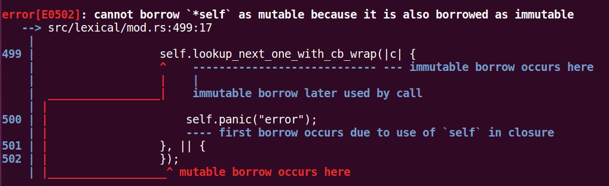

## 工具方法
### 封装查看下一个字符
- 功能
	- 查看下一个字符, 如果读取不到, 从 callback 中读取新的序列
	- 如果读取到了数据, 以回调的方式返回给上层
- 目的
	- 对于需要判断下一个字符是否是所需的字符时, 可以省去处理回调的麻烦
- 代码
```rust
336     fn lookup_next_one_with_cb_wrap<FindF, EndF>(&mut self, mut find_f: FindF, mut end_f: EndF)
337         where FindF: FnMut(char), EndF: FnMut() {
338         match self.content.lookup_next_one() {
339             Some(c) => {
340                 find_f(c);
341             },
342             None => {
343                 match (self.cb)() {
344                     CallbackReturnStatus::Continue(content) => {
345                         self.content_assign(content);
346                         match self.content.lookup_next_one() {
347                             Some(c) => {
348                                 find_f(c);
349                             },
350                             None => {
351                                 panic!("should not happend");
352                             }
353                         }
354                     },
355                     CallbackReturnStatus::End => {
356                         end_f();
357                     }
358                 }
359             }
360         }
361     }
```

- 调用一下 (在回调中调用成员方法试一下)
```rust
495     #[test]
496     fn lookup_next_one_with_cb_wrap_test() {
497         impl<T: FnMut() -> CallbackReturnStatus> LexicalParser<T> {
498             fn test(&mut self) {
499                 self.lookup_next_one_with_cb_wrap(|c| {
500                     self.panic("error");
501                 }, || {
502                 });
503             }
504         }
505     }
```
显示了错误


- 错误原因
	- 因为在 **&mut self** 的作用域中使用了 **&self**, 这是借用检查器不允许的
- 问题解决
	- 借用检查器无法进行细致的检查, 所以这里判断到了作用域问题后, 就提示错误, 但是这里的方法调用中并没有不安全的地方, 这个时候就需要找办法, 避开借用检查器的检查 ***这是一个小技巧***
	```rust
	308     fn lookup_next_one_with_cb_wrap<FindF, EndF>(&mut self, mut find_f: FindF, mut end_f: EndF)
	309         where FindF: FnMut(&mut LexicalParser<T>, char), EndF: FnMut(&mut LexicalParser<T>) {
	310         match self.content.lookup_next_one() {
	311             Some(c) => {
	312                 find_f(self, c);
	313             },
	314             None => {
	315                 match (self.cb)() {
	316                     CallbackReturnStatus::Continue(content) => {
	317                         self.content_assign(content);
	318                         match self.content.lookup_next_one() {
	319                             Some(c) => {
	320                                 find_f(self, c);
	321                             },
	322                             None => {
	323                                 panic!("should not happend");
	324                             }
	325                         }
	326                     },
	327                     CallbackReturnStatus::End => {
	328                         end_f(self);
	329                     }
	330                 }
	331             }
	332         }
	333     }
	```
	- 改进的办法就是将 self 通过参数传递给回调方法体, 这样的话, 在调用的时候就不会存在 **&mut self** 和 **&self** 冲突的作用域了
	```rust
	469     fn lookup_next_one_with_cb_wrap_test() {
	470         impl<T: FnMut() -> CallbackReturnStatus> LexicalParser<T> {
	471             fn test(&mut self) {
	472                 self.lookup_next_one_with_cb_wrap(|parser, c| {
	473                     parser.panic("error");
	474                 }, |parser| {
	475                 });
	476             }
	477         }
	478     }
	```
